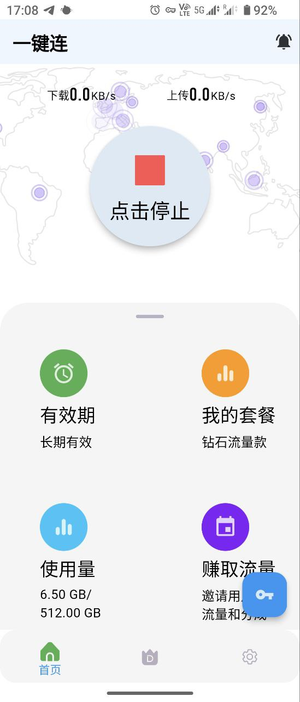
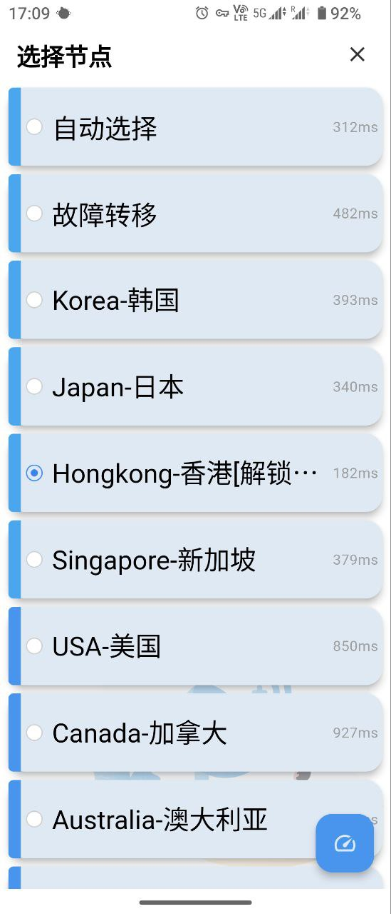
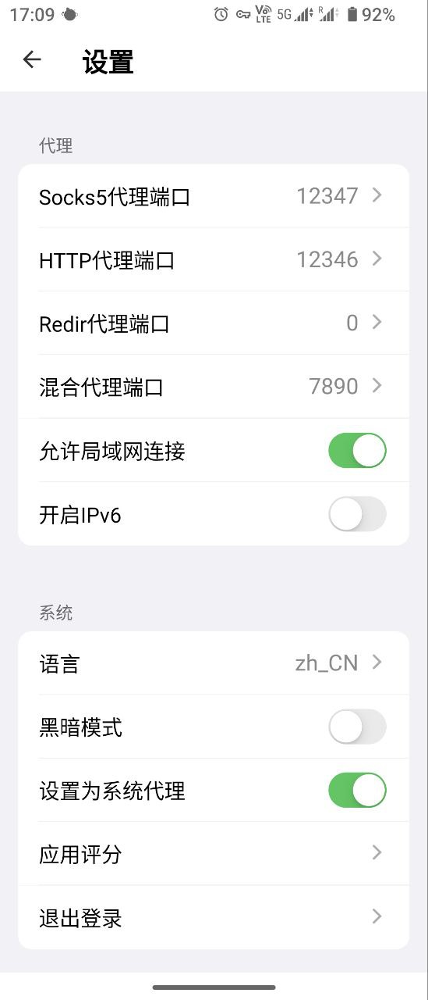

# 已删除源码，该项目已经不可编译！

# CrossApp

- 一款支持对接V2board的跨平台客户端，可以运行于windows、Android、macOS、Linux等平台
- [English](README_EN.md)

# 对接v2board版本

- [V2board](https://github.com/v2board/v2board)
  支持v2board1.7.4及以上版本，其他版本自行适配

# 功能

- 同时支持Android、Windows、MacOS以及各种Linux图形界面
- 在线获取配置文件,避免因网址被墙造成客户端无法使用
- 用户注册、登录
- 订阅套餐购买,支持套餐json渲染
- 集成在线客服系统crisp
- 节点测速

# Demo：(以Android设备为例，其他设备UI界面类似)

# 社区

Telegram Group: [@classcross](https://t.me/clashcross)

# 简易教程

确保您使用的v2board版本，修改lib/http/options.dart
中cfgurl为你的配置文件在线获取地址，另外您可能需要了解Dart编程和Flutter跨平台框架以便进行二次开发

# 详细教程

## Android构建(暂时没写，等有时间写)

## Windows构建(暂时没写，等有时间写)

## MacOS构建(暂时没写，等有时间写)

## Linux构建(暂时没写，等有时间写)
# 爱发电
[为爱发电](https://afdian.net/a/oneclick)
# 警告
该源码仅做技术交流，图片仅用于展示，不提供任何交互功能，任何人基于该源码编译出的可执行文件与作者无关!
请遵守当地法律法规，特别位于，伊朗、北韩、白俄罗斯、土库曼斯坦、古巴等等居民切勿编译和二次分发！
Please exercise caution in compiling this program for countries with strict internet control, such
as Iran, North Korea, Belarus, Turkmenistan, Cuba, etc.
